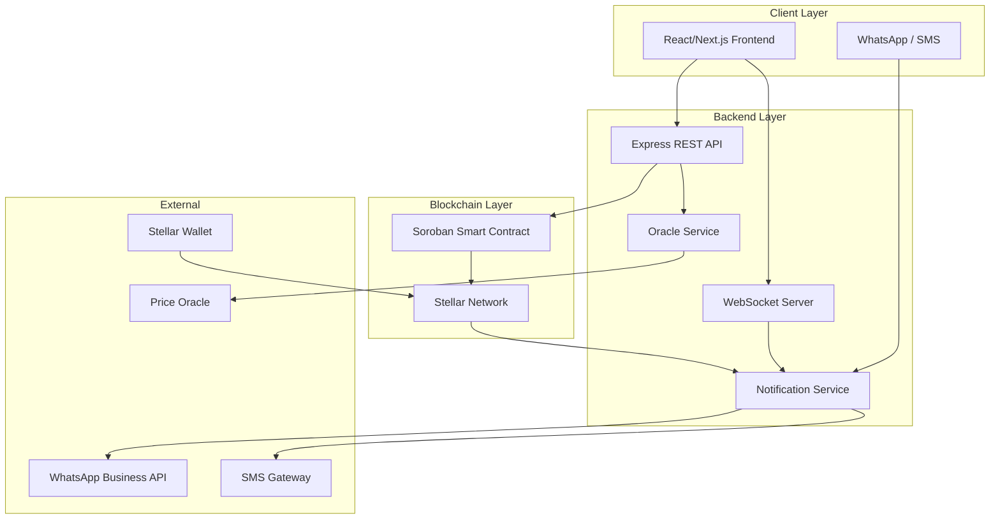

# Receipta

[](https://github.com/your-org/receipta-platform/actions)
[](https://opensource.org/licenses/MIT)
[](https://soroban.stellar.org)
[](https://stellar.expert/explorer/testnet/contract/CDLYITDQBWS7YWD5SGVXED4S4PCZEJJAOODOQ3OFSKJV5HX4ZLKKFWGC)

Blockchain-powered payment verification built on Stellar using Soroban smart contracts. Receipta eliminates payment fraud by generating tamper-proof, cryptographically verifiable digital receipts for every transaction — no more fake screenshots or edited SMS alerts.

## 🚀 Live Deployment

**Status:** ✅ Deployed and Running on Stellar Testnet

- **Contract Address:** `CDLYITDQBWS7YWD5SGVXED4S4PCZEJJAOODOQ3OFSKJV5HX4ZLKKFWGC`
- **Network:** Stellar Testnet
- **Deployed:** may 2026
- **View on Stellar Expert:** [Contract Details](https://stellar.expert/explorer/testnet/contract/CDLYITDQBWS7YWD5SGVXED4S4PCZEJJAOODOQ3OFSKJV5HX4ZLKKFWGC)

### Try It Live

The contract is fully functional on Stellar testnet. You can:
- Create tamper-proof receipts
- Verify payment authenticity
- Query receipt history
- Test the full payment flow

## Quick Links

- 📚 [Quick Start Guide](QUICKSTART.md) - Get running in 5 minutes
- 🚀 [Deployment Guide](DEPLOYMENT.md) - Deploy to testnet/mainnet
- 📖 [API Documentation](docs/API.md) - Complete API reference
- ✨ [Features](docs/FEATURES.md) - Feature overview and roadmap
- 🤝 [Contributing](CONTRIBUTING.md) - How to contribute

## Project Status

**Current Phase:** ✅ MVP Deployed to Testnet

- ✅ Smart contract fully implemented with comprehensive tests
- ✅ Backend API with authentication and core routes
- ✅ Frontend with verification, dashboard, and auth pages
- ✅ **Deployed to Stellar testnet and fully functional**
- ✅ Contract initialized with fee configuration
- ✅ Comprehensive documentation and deployment guides
- 🔄 Production features (notifications, webhooks) in development

**Testnet Deployment:**
- Contract ID: `CDLYITDQBWS7YWD5SGVXED4S4PCZEJJAOODOQ3OFSKJV5HX4ZLKKFWGC`
- Network: Stellar Testnet
- Status: Live and operational
- View: [Stellar Expert](https://stellar.expert/explorer/testnet/contract/CDLYITDQBWS7YWD5SGVXED4S4PCZEJJAOODOQ3OFSKJV5HX4ZLKKFWGC)

**Documentation:**
- [API Documentation](docs/API.md)
- [Features Overview](docs/FEATURES.md)
- [Deployment Guide](DEPLOYMENT.md)
- [Contributing Guidelines](CONTRIBUTING.md)

## Architecture

```
receipta-platform/
├── contract/          # Rust/Soroban smart contract (on-chain receipt storage)
├── backend/           # Node.js/Express TypeScript API
├── frontend/          # Next.js TypeScript web app
├── .env.example       # Environment variable reference
└── package.json       # Monorepo root (npm workspaces)
```



The smart contract is the source of truth — receipt data lives in Soroban persistent storage on-chain. The backend is stateless with respect to receipt data; it reads from the chain and caches for performance. Receipt IDs are deterministic hashes of transaction parameters, enabling independent verification by any party.

## Prerequisites

| Tool | Version | Install |
|------|---------|---------|
| Rust | ≥ 1.74 | [rustup.rs](https://rustup.rs) |
| Node.js | ≥ 18 | [nodejs.org](https://nodejs.org) |
| npm | ≥ 9 | Bundled with Node.js |
| Stellar CLI | latest | `cargo install --locked stellar-cli --features opt` |
| PostgreSQL | ≥ 14 | [postgresql.org](https://www.postgresql.org) |

After installing Rust, add the Wasm target:

```bash
rustup target add wasm32-unknown-unknown
```

## Setup

### 1. Clone and install

```bash
git clone https://github.com/your-org/receipta-platform.git
cd receipta-platform
npm install          # installs backend + frontend workspaces
```

### 2. Environment variables

```bash
cp .env.example .env
# Edit .env with your values — see Environment Variables section below
```

### 3. Smart contract (`contract/`)

```bash
cd contract

# Build the contract
cargo build --target wasm32-unknown-unknown --release

# Run contract tests
cargo test

# Deploy to Stellar testnet (requires Stellar CLI and funded account)
stellar contract deploy \
  --wasm target/wasm32-unknown-unknown/release/receipta_contract.wasm \
  --network testnet \
  --source <YOUR_SECRET_KEY>
```

Copy the deployed contract address into your `.env` as `CONTRACT_ID`.

### 4. Backend (`backend/`)

```bash
cd backend

# Install dependencies (or use root: npm install --workspace=backend)
npm install

# Run database migrations
psql $DATABASE_URL -f migrations/001_init.sql

# Start development server
npm run dev
# → http://localhost:3001
```

### 5. Frontend (`frontend/`)

```bash
cd frontend

# Install dependencies (or use root: npm install --workspace=frontend)
npm install

# Start development server
npm run dev
# → http://localhost:3000
```

## Environment Variables

| Variable | Required | Description |
|----------|----------|-------------|
| `STELLAR_RPC_URL` | Yes | Soroban RPC endpoint (testnet: `https://soroban-testnet.stellar.org`) |
| `CONTRACT_ID` | Yes | Deployed Receipta contract address on Stellar |
| `DATABASE_URL` | Yes | PostgreSQL connection string |
| `JWT_SECRET` | Yes | Secret key for signing authentication tokens (min 32 chars) |
| `WHATSAPP_API_KEY` | Yes | WhatsApp Business API key for notifications |
| `SMS_API_KEY` | Yes | SMS gateway API key (Twilio or Africa's Talking) |
| `PRICE_ORACLE_URL` | Yes | Fiat/crypto price oracle base URL |
| `PORT` | No | Backend server port (default: `3001`) |
| `NODE_ENV` | No | `development` or `production` |

## Running Tests

### All tests (from repo root)

```bash
npm test
```

This runs contract tests, backend tests, and frontend tests in sequence.

### Smart contract tests only

```bash
npm run test:contract
# or directly:
cargo test --manifest-path contract/Cargo.toml
```

### Backend tests only

```bash
npm run test:backend
# or from backend/:
npm test
```

### Frontend tests only

```bash
npm run test:frontend
# or from frontend/:
npm test
```

## API Overview

| Method | Path | Auth | Description |
|--------|------|------|-------------|
| `POST` | `/api/auth/register` | — | Merchant registration |
| `POST` | `/api/auth/login` | — | Merchant login |
| `GET` | `/api/receipts/:id` | — | Public receipt lookup |
| `POST` | `/api/payment-links` | JWT | Create payment link |
| `GET` | `/api/payment-links/:id` | — | Get payment link details |
| `GET` | `/api/merchant/receipts` | JWT | Merchant receipt history |
| `GET` | `/api/merchant/stats` | JWT | Aggregate stats |
| `GET` | `/api/price/:asset` | — | Fiat conversion rate |
| `WS` | `/ws` | JWT (query param) | Real-time payment events |

## Project Structure

```
contract/
├── Cargo.toml
└── src/
    ├── lib.rs          # Contract entry point and public functions
    └── types.rs        # Receipt, ReceiptStatus, FeeConfig, ReceiptError

backend/
├── package.json
├── tsconfig.json
├── jest.config.js
├── migrations/         # SQL migration files
└── src/
    ├── app.ts          # Express app setup
    ├── middleware/
    │   └── auth.ts     # JWT auth middleware
    ├── routes/         # Route handlers
    ├── stellar/
    │   └── client.ts   # Stellar/Soroban SDK wrapper
    ├── notifications/  # WhatsApp, SMS, retry logic
    ├── ws/             # WebSocket server
    └── oracle/         # Price oracle service

frontend/
├── package.json
├── tsconfig.json
├── next.config.js
├── tailwind.config.js
└── src/
    ├── app/            # Next.js App Router pages
    ├── components/     # Shared UI components
    └── lib/            # API client, Stellar wallet helpers
```

## License

MIT
